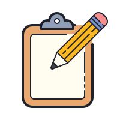

[![LinkedIn][linkedin-shield]][linkedin-url]

 

  

  <h3 align="center">To-Do List</h3>

## Sobre

[![Product Name Screen Shot][product-screenshot]]

Um simples To-Do List feito usando React Native!

### Feito Com

* [React Native](https://reactnative.dev/)
* [Expo](https://expo.io/)

## Contato

Ralf Dewrich Ferreira - [@ralfdewrich](https://twitter.com/ralfdewrich) - ralfferreira995@gmail.com

[linkedin-shield]: https://img.shields.io/badge/-LinkedIn-black.svg?style=for-the-badge&logo=linkedin&colorB=555
[linkedin-url]: https://www.linkedin.com/in/ralfferreira/
[product-screenshot]: assets/product.png